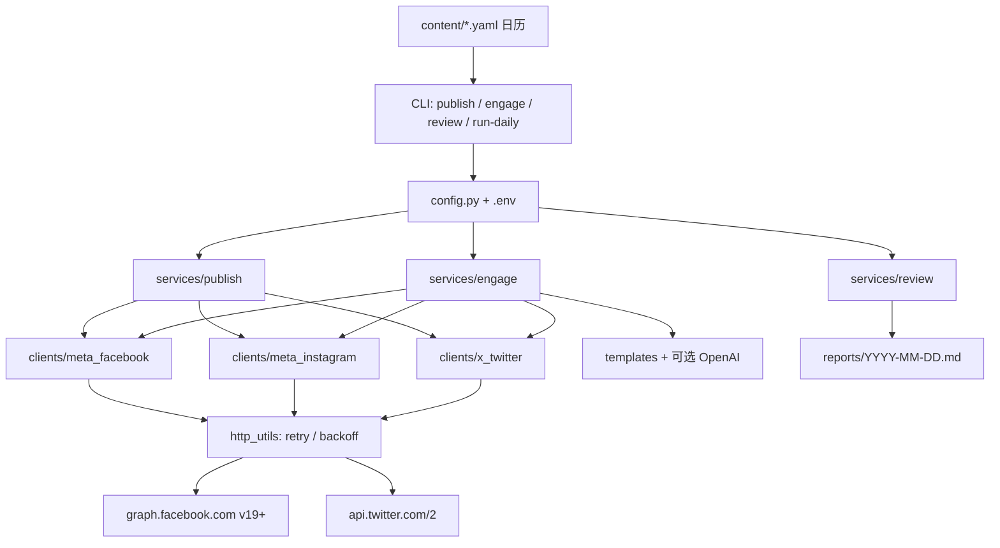

# Social Autopilot

面向美妆品牌的 **云端每日社媒自动化**：仅使用官方 API，完成自有账号发帖、对**自家帖子评论**的轻度互动，以及每日复盘报告。

**仓库：** https://github.com/xutian0101/social-autopilot

| 平台 | 官方能力 |
|------|----------|
| Facebook Page | Graph API `/{page-id}/feed` · `/photos` · 评论回复 |
| Instagram Business | Content Publishing API（container → publish）· 评论回复 |
| X / Twitter | API v2 `POST /2/tweets` · 会话内回复检索 |

> **默认 `DRY_RUN=true`**：不会真实发帖。密钥只通过环境变量 / `.env` 注入。

---

## 架构



### 硬约束（设计内置）

- **仅官方 API**：无爬虫、无 Selenium 登录、无 Cookie 劫持。
- **互动范围**：只回复**我们自己帖子**下的评论；无群发关注、无群发私信、无互赞互粉。
- **限流**：HTTP 重试 + 指数退避；`DAILY_POST_CAP` / `DAILY_ENGAGE_CAP` / `MAX_REPLIES_PER_POST`。

---

## 快速开始

```bash
cd social-autopilot
python -m venv .venv && source .venv/bin/activate   # Windows: .venv\Scripts\activate
pip install -e ".[dev]"
cp .env.example .env   # 保持 DRY_RUN=true

# 确保 content/ 下有当天 YAML（示例：content/samples/2026-09-07.yaml）
# 或设置 CONTENT_DIR，或把样品复制到 content/YYYY-MM-DD.yaml

DRY_RUN=true python -m social_autopilot run-daily
```

### CLI

```bash
python -m social_autopilot publish
python -m social_autopilot engage
python -m social_autopilot review
python -m social_autopilot run-daily
```

### 内容日历 YAML 示例

```yaml
date: 2026-09-07
platforms: [facebook, instagram, x]
text: |
  早安～轻薄保湿从这一滴开始 ✨
hashtags: [护肤, Skincare]
media: placeholder.jpg          # FB 可用本地图；IG 正式环境需公网 image_url
image_url: https://cdn.example.com/serum.jpg
link: https://example.com/p/serum
```

---

## Meta（Facebook + Instagram）配置

1. 在 [Meta for Developers](https://developers.facebook.com/) 创建应用，添加 **Facebook Login** / **Instagram Graph API**。
2. 将 Instagram 专业账号绑定到 Facebook主页。
3. 申请并生成**长期 Page Access Token**（建议权限示例）：
   - `pages_manage_posts`, `pages_read_engagement`, `pages_show_list`
   - `instagram_basic`, `instagram_content_publish`, `instagram_manage_comments`
   - 洞察可选：`read_insights`, `instagram_manage_insights`
4. 写入 `.env`：
   - `META_ACCESS_TOKEN` — Page Token
   - `META_PAGE_ID` — 主页 ID
   - `META_IG_USER_ID` — IG 商业用户 ID（`/{page-id}?fields=instagram_business_account`）
5. **Instagram 发图**：Content Publishing 需要可公网访问的 `image_url`（HTTPS）。本地路径仅用于 `DRY_RUN` 演示。

Graph 版本默认 `v19.0`（可用 `META_GRAPH_VERSION` 覆盖）。

---

## X / Twitter 配置

1. 在 [X Developer Portal](https://developer.twitter.com/) 创建 Project + App，开通 **Read and Write**。
2. 生成 **OAuth 1.0a** Consumer Keys + Access Token/Secret（发帖推荐）。
3. （可选）Bearer Token 用于 recent search。
4. 写入 `.env`：`X_API_KEY`, `X_API_SECRET`, `X_ACCESS_TOKEN`, `X_ACCESS_TOKEN_SECRET`，以及可选 `X_BEARER_TOKEN`。

互动仅检索 `conversation_id` 属于我们推文的回复，再 `POST /2/tweets` 回复。

---

## Docker / 定时任务

```bash
cp .env.example .env
docker compose --profile manual run --rm social-autopilot
```

主机 cron 示例（上海时间约 09:00）：

```cron
0 9 * * * cd /path/to/social-autopilot && docker compose --profile manual run --rm social-autopilot
```

或使用 GitHub Actions：`.github/workflows/daily.yml`（UTC 01:00 ≈ 上海 09:00）。把密钥放进仓库 Secrets，`DRY_RUN` 用 Variables 控制。

---

## 测试

```bash
pip install -e ".[dev]"
pytest -q
```

包含 publish / engage / review 的 DRY_RUN 用例，以及 httpx/respx 重试测试。

---

## 目录结构

```
social_autopilot/          # Python 包
  clients/                 # Meta FB / IG / X 官方客户端
  services/                # publish · engage · review · templates
content/samples/           # 内容日历样例
reports/                   # 每日复盘 Markdown
.github/workflows/daily.yml
Dockerfile · docker-compose.yml
```

---

## 合规与 ToS 警告

- 必须遵守 [Meta Platform Terms](https://developers.facebook.com/terms/) 与 [X Developer Agreement](https://developer.twitter.com/en/developer-terms)。
- 本项目**不会**绕过官方 API、抓取登录态或批量骚扰用户。
- 上线前请将 `DRY_RUN=false` 仅用于你**拥有管理权**的账号，并确认广告/促销文案符合当地法规与平台政策。
- 自动化互动仍可能受平台质量过滤；请保持低频、人工抽检回复模板。

---

# English

**Social Autopilot** is a cloud-ready daily automation toolkit for beauty-brand marketing on Facebook Pages, Instagram Business, and X — **official APIs only**.

- **Publish** today’s YAML calendar items (text / photo / tweet).
- **Engage** by replying to comments on **your own posts** only (templates or optional OpenAI-compatible drafting).
- **Review** writes `reports/YYYY-MM-DD.md` (insights best-effort; always summarizes actions).

Defaults: `DRY_RUN=true`, secrets via `.env`, retries/backoff, daily caps.

```bash
pip install -e ".[dev]"
DRY_RUN=true python -m social_autopilot run-daily
pytest -q
```

See Chinese sections above for Meta/X setup, Docker/cron, and ToS warnings.
